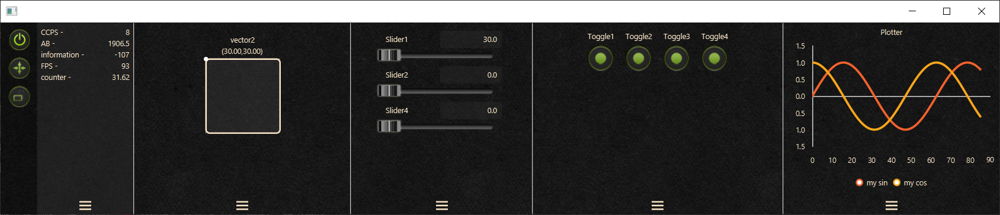

# Code Controller
  
   
Code Controller (aka CC) is an immediate plug & play GUI tool that is mainly aimed for the development of creative and visual programs. The main focus of the project are ease of use and overhead zeroing while trying to (1) provide powerful tools to debug and interact with a live program, (2) minimizing software iterations and gui controls setup time, (3) be portable between different platforms and frameworks.

The project is still in development and will include additional features in the future. The core functionality will probably remain, although some UI changes and few bug fixes are still required.
Any direct or indirect support and contribution will be much appreciated. 

**Notes**  
- The GUI elements are placed automatically in their dedicated panes. CC is not intended to be an "end user" gui library but rather a quick and easy way to control and debug your program variables.  
- The GUI panel is opened as a **separate window** using an independent TornadoFX app. This way it doesn't matter what framework or platform you are using, as long as it's in kotlin/java.
  
  
For more in-depth explanations refer to the [wiki page](https://github.com/yokiano/code_controller/wiki).  
Alternatively, watch a 10min coding demo which explains most of what you need to know about CC:
https://youtu.be/vF_XVmXhOjg

**An example of a fully equipped controls panel:**



**Core features overview:**
1. The controllers:
   1. Slider (ccDouble)
   1. Boolean toggle (ccBool)
   1. XY Controller (ccVec2)
1. Information pane - displays a dynamically updated strings (ccInfo). 
1. Real time plotter (ccPlot).
1. Value Registry - Save/Load values to/from a automatically created local file. Controllers are initialized with the previously saved value on startup. 
1. Remove and Refactor - after you finish to use a control, normally you would go back to the source code to remove the gui elelemnts declarations manually. Instead of doing so this feature will remove a controller from the gui panel AND will automatically replace the source code declaration of that controller with the current controller value. Use with care.  
1. Fast resizing - The UI panel is designed for quick resizing and placement so you will spend less time dealing with layouting your windows and panes.
1. Touch screen friendly - The UI components are big and flexible enough so it will be possible to use CC on external touchscreens more easily.   
  

**Future Plans**
1. Support of additional controls such as - range slider, option selector, color picker, XYZ controller, action button
1. Improve layout flexibility and grouping features.
1. Keyboard shortcuts for everything.
1. Improve support for touch screens.  

## Installation via gradle:

**Using gradle with kotlin script (build.gradle.kts file):**
```kotlin
repositories {
	// …
  jcenter()	// <- needed due to internal dependencies
  maven(url = "https://dl.bintray.com/yokiano/my-tools")
}

dependencies {
	// ...
  implementation("yokiano","code-controller", "0.0.7")
}
```
 
**Using gradle with groovy script (build.gradle file):**
```groovy
repositories {
	// …
  jcenter()	// <- needed due to internal dependencies
  maven url = ‘https://dl.bintray.com/yokiano/my-tools’
}

dependencies {
	// ...
  implementation ‘yokiano:code-controller:0.0.7’
}
```  


## Basic Usage:
```kotlin
import yokiano.codecontroller.domain.*

// EXAMPLE 1 - not in a class context
fun main() {
  val someDoubleValue = CodeController.ccDouble("my slider") // will add a slider controller with “my slider” as id and default range of 0 to 1.
}

// EXAMPLE 2 - inside a class.
class MyClass : CCAware {
	
	fun someFunction() {
		val someDoubleValue = ccDouble("my slider") // will add a slider controller with “my slider” as id and default range of 0 to 1.

		val xyPairValue = ccVec2("my 2D vector") // will add a 2D vector controller with “my 2D vector” as id and default range of 0 to 1 (both in x and y).
	}
}
```  

There are two ways of invoking code controller functions, (1) referring to the global object CodeController as done in EXAMPLE 1 above, (2) extending CCAware class and using the controller methods directly as done in EXAMPLE 2 above. 
  
The above examples present **only** the usage of a single and default slider controller, for other controller types and the full documentation refer to the [wiki page](https://github.com/yokiano/code_controller/wiki).  


